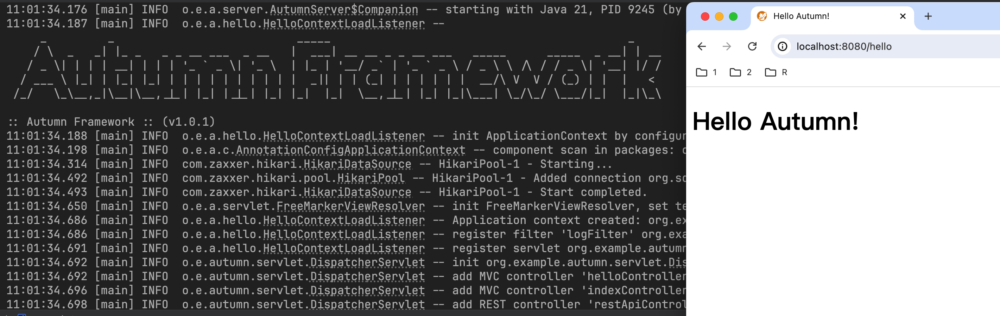

 

# Autumn

_Yet another toy web application framework imitating Spring with homemade http server in Kotlin._



## Features

- [x] DI + AOP + MVC web framework
- [x] Homemade Jakarta Servlet 6.0 http server
- [x] JdbcTemplate and naive ORM, support @Transactional annotation
- [x] Standard .war packaging
- [x] Demo webapp

## Demo

Please refer to hello-autumn.

### Example: hello-autumn (user login demo)

Write Autumn just like Spring.

```kotlin
@Controller("/")
class IndexController(@Autowired private val userService: UserService) {
    companion object {
        const val USER_SESSION_KEY = "USER_SESSION_KEY"
    }

    @Get("/")
    fun index(session: HttpSession): ModelAndView {
        val user = session.getAttribute(USER_SESSION_KEY)
        return if (user == null)
            ModelAndView("redirect:/register") else ModelAndView("/index.ftl", mapOf("user" to user))
    }

    @Get("/register")
    fun register(): ModelAndView {
        return ModelAndView("/register.ftl")
    }

    @Post("/register")
    fun register(
        @RequestParam email: String,
        @RequestParam name: String,
        @RequestParam password: String
    ): ModelAndView {
        return try {
            userService.createUser(email, name, password)
            ModelAndView("redirect:/login")
        } catch (e: Exception) {
            ModelAndView("/register.ftl", mapOf("error" to "$email already registered"))
        }
    }

    @Get("/login")
    fun login(): ModelAndView {
        return ModelAndView("/login.ftl")
    }

    @Post("/login")
    fun login(@RequestParam email: String, @RequestParam password: String, session: HttpSession): ModelAndView {
        val user = userService.getUser(email)
        if (user == null || user.password != password) {
            return ModelAndView("/login.ftl", mapOf("error" to "email or password is incorrect"))
        }
        session.setAttribute(USER_SESSION_KEY, user)
        return ModelAndView("redirect:/")
    }

    @Get("/logoff")
    fun logoff(session: HttpSession): String {
        session.removeAttribute(USER_SESSION_KEY)
        return "redirect:/login"
    }
}

```

test account: _test@test.com: test_


