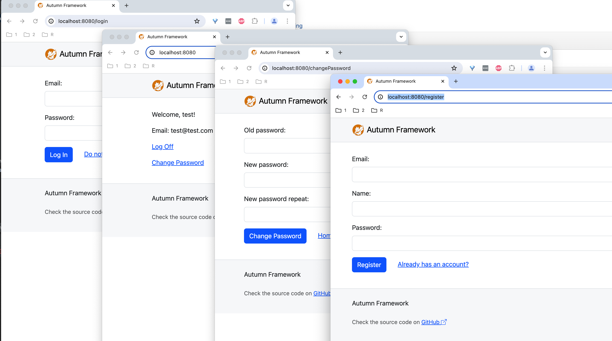

<div align="center">  </div>

<div align="center"> 
<h1>Autumn Framework</h1>
Yet another web application framework imitating Spring in Kotlin.
</div>


## Features

- [x] DI + AOP + EventBus + MVC web framework
- [x] Homemade Jakarta Servlet 6.1 http server
- [x] JdbcTemplate and naive ORM, support @Transactional annotation
- [x] Standard .war packaging
- [x] Demo webapp

## Demo

autumn-hello (user login demo), use Autumn just like Spring



### Let's have a try

```shell
# build (please use JDK 21+)
ls                     # current path: xxx/autumn
cd ./autumn-build/     # cd to xxx/autumn/autumn-build/
mvn clean              # clean previous build
mvn install            # build and install builds to maven local cache
cd ../autumn-hello/    # cd to xxx/autumn/autumn-hello/ 
mvn war:war            # build .war package for autumn-hello project

# start web application with homemade http server
ls                     # current path: xxx/autumn
cp ./autumn-hello/target/autumn-hello-1.1.war ./autumn-core/target/autumn-hello-1.1.war
cd ./autumn-core/target/
# execute autumn-hello-1.1.war with homemade http server in autumn-core
java -jar autumn-core-1.1.jar -w autumn-hello-1.1.war

# or start web application with Tomcat and docker
ls                     # current path: xxx/autumn
cd ./autumn-hello/
docker build -t autumn-hello . 
docker run -p 8080:8080 -t autumn-hello

# then access localhost:8080 to play with the demo

```


### Example:

```kotlin
// Main.kt (part of)
@Controller
class IndexController @Autowired constructor(private val userService: UserService) {
    companion object {
        const val USER_SESSION_KEY = "USER_SESSION_KEY"
    }

    @Autowired
    private lateinit var eventBus: EventBus

    @Autowired
    private lateinit var context: ApplicationContext

    @PostConstruct
    fun init() {
        // @Transactional proxy of UserService injected
        assert(userService.javaClass != UserService::class.java)
        assert(userService === context.getUniqueBean(UserService::class.java))
        assert(context.config.getRequiredString("autumn.config-class-name") == "io.nuclearmissile.autumn.hello.HelloConfig")
    }

    @Get("/")
    fun index(session: HttpSession): ModelAndView {
        val user = session.getAttribute(USER_SESSION_KEY)
        return if (user == null)
            ModelAndView("redirect:/login") else ModelAndView("/index.ftl", mapOf("user" to user))
    }

    @Get("/register")
    fun register(session: HttpSession): ModelAndView {
        val user = session.getAttribute(USER_SESSION_KEY)
        return if (user == null)
            ModelAndView("/register.ftl") else ModelAndView("redirect:/")
    }

    @Post("/register")
    fun register(
        @RequestParam email: String, @RequestParam name: String, @RequestParam password: String,
    ): ModelAndView {
        if (name.isBlank()) return ModelAndView("/register.ftl", mapOf("error" to "name is blank"))
        return if (userService.register(email, name, password) != null)
            ModelAndView("redirect:/login")
        else
            ModelAndView("/register.ftl", mapOf("error" to "user registration failed"))
    }

    @Get("/login")
    fun login(session: HttpSession): ModelAndView {
        val user = session.getAttribute(USER_SESSION_KEY)
        return if (user == null)
            ModelAndView("/login.ftl") else ModelAndView("redirect:/")
    }

    @Post("/login")
    fun login(@RequestParam email: String, @RequestParam password: String, session: HttpSession): ModelAndView {
        val user = userService.validate(email, password)
            ?: return ModelAndView("/login.ftl", mapOf("error" to "email or password is incorrect"))
        session.setAttribute(USER_SESSION_KEY, user)
        eventBus.post(LoginEvent(user))
        return ModelAndView("redirect:/")
    }

    @Get("/logoff")
    fun logoff(session: HttpSession): String {
        val user = session.getAttribute(USER_SESSION_KEY) as User?
            ?: throw RequestErrorException("cannot logoff due to not logged in")
        session.removeAttribute(USER_SESSION_KEY)
        eventBus.post(LogoffEvent(user))
        return "redirect:/login"
    }

    @Get("/changePassword")
    fun changePassword(session: HttpSession): ModelAndView {
        session.getAttribute(USER_SESSION_KEY)
            ?: throw RequestErrorException("cannot change password due to not logged in")
        return ModelAndView("/changePassword.ftl")
    }

    @Post("/changePassword")
    fun changePassword(
        @RequestParam("old_password") oldPassword: String,
        @RequestParam("new_password") newPassword: String,
        @RequestParam("new_password_repeat") newPasswordRepeat: String,
        session: HttpSession,
    ): ModelAndView {
        val user = session.getAttribute(USER_SESSION_KEY) as User?
            ?: throw RequestErrorException("cannot change password due to not logged in")
        if (newPassword != newPasswordRepeat)
            return ModelAndView("/changePassword.ftl", mapOf("error" to "passwords are different"))
        if (newPassword == oldPassword)
            return ModelAndView("/changePassword.ftl", mapOf("error" to "new password must be different from old one"))
        userService.validate(user.email, oldPassword)
            ?: return ModelAndView("/changePassword.ftl", mapOf("error" to "old password is incorrect"))
        if (userService.changePassword(user, newPassword)) {
            session.removeAttribute(USER_SESSION_KEY)
            return ModelAndView("redirect:/login")
        } else {
            throw ServerErrorException("change password failed due to internal error")
        }
    }
}

```


## Ref

- https://github.com/michaelliao/summer-framework
- https://github.com/zzzzbw/doodle
- https://github.com/fuzhengwei/small-spring
- https://github.com/maxim5/routekit


